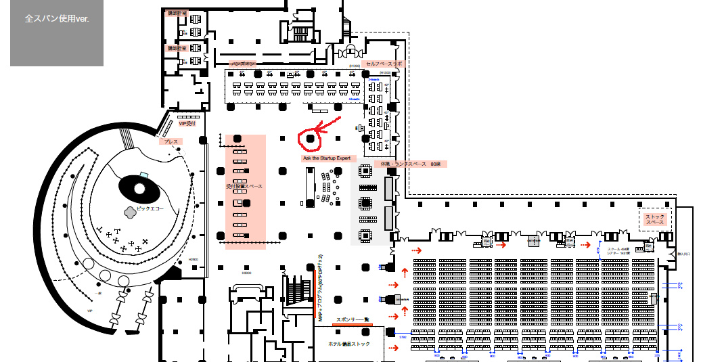

# aws-summit-tokyo-2018-ug-booth-tasks

# 連絡場所

make-jawsug.slack.com の #summit2018tkybooth チャンネルまで。

# リアル会場の場所

Startup 関連エリアの横、セルフスペースラボの前にあたる部分の赤い丸で囲んでいる位置で、部屋は飛天です。

# ブース担当者

スタッフTシャツあります。2018-05-25現在応募終了？
https://docs.google.com/spreadsheets/d/1sNQBBMyb_SBo6TY3OLsAopINctivLH5u4tla7y81ogQ/edit#gid=2011212844

## 受取

ブースにて配布。(できれば実質準備中のDay1の午前中に取りに来て欲しい)

# シフト表

https://docs.google.com/spreadsheets/d/1sNQBBMyb_SBo6TY3OLsAopINctivLH5u4tla7y81ogQ/edit#gid=0

# 当日までに

## 紙の配布など配りたいものがあれば

https://make-jawsug.slack.com/files/U6NU9AKEC/FAUQ5FC0Z/aws_summit_2018_________________________.xlsx

# 当日何をやるのか

- ブース自体は9:00にオープン(前日29日にPCセットアップ済み)
- シフト表通りブースにきてください
- お客さんがいらっしゃったらJAWS-UGと各支部の紹介と案内
- 各支部紹介などのPPTがくるくる自動再生されているPC・40inchディスプレイがあるので見張る
- JAWS-UGステッカー・re:Mixステッカーを配る

# re:Mix入場について

re:Mixがあっという間に満席になってしまったため、各支部JAWS-UGメンバーが申し込めなかった。
運営としても入れないので、JAWS-UGメンバーかつ当日re:Mix希望者にはオフィシャル許可シールを配っています。
（シールのデザインは、↑で配っているre:Mixステッカーのサイズ違い)

詳細は以下を参照。欲しい方が現れたら以下ドキュメントの「シール配布協力者」を参照し案内してください。

https://docs.google.com/document/d/1I2UyMtYPx1Ca4kLFlilkjEvBufOvXxXLHlV-VmeAi3k/edit?usp=sharing

